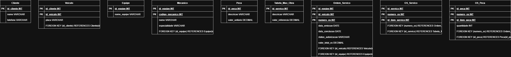

# 🔧 Modelagem de Banco de Dados: ERP de Oficina Mecânica

Este repositório contém o modelo conceitual e lógico de um sistema de gerenciamento de Ordens de Serviço (OS) para oficinas mecânicas, desenvolvido como parte do desafio da Digital Innovation One (DIO).

## 🎯 Objetivo de Negócio e Visão Financeira
Em prestação de serviços, a rentabilidade é medida OS por OS. O objetivo desta modelagem não foi apenas criar um cadastro, mas estruturar um banco de dados que permita à Controladoria calcular com precisão as margens de contribuição.

## 🛠️ Regras de Negócio e Refinamentos (Visão FP&A):
1. **Separação de Receitas (Peças vs. Serviços):**
   - **Por que isso importa:** A tributação (ISS para serviços, ICMS para peças) é completamente diferente. O banco de dados separa a `Tabela_Mao_Obra` das `Pecas` e usa tabelas associativas (`OS_Servico` e `OS_Peca`) para compor a OS, permitindo cálculos tributários precisos e análise de rentabilidade separada.

2. **Custeio Baseado em Equipes:**
   - **Por que isso importa:** A tabela `Equipe` agrupa os `Mecanicos` e é diretamente ligada à `Ordem_Servico`. Isso permite que o Controller calcule a produtividade e a rentabilidade da mão de obra por equipe, cruzando a folha de pagamento (custo fixo) com os serviços entregues.

3. **Status de Autorização (Reconhecimento de Receita):**
   - A `Ordem_Servico` possui um campo de `status_autorizacao`. Somente quando o cliente aprova o orçamento, a produção (serviço) começa. Isso é fundamental para provisionamento de fluxo de caixa e gestão de estoque de peças.

## 📊 Diagrama do Modelo Relacional

